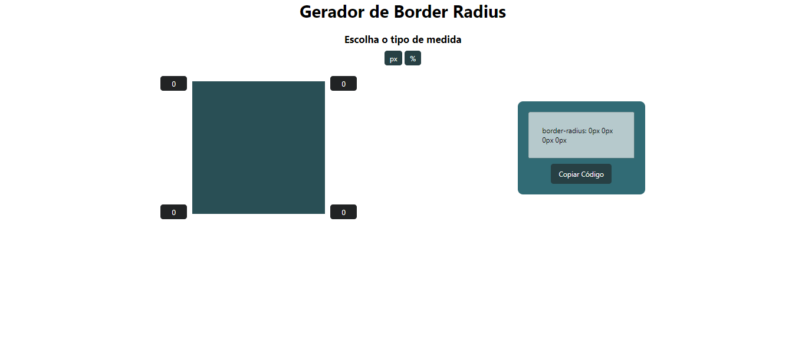

<h1 align="center">Gerador de Border Radius</h1>

Usando os conhecimentos de HTML, CSS e Javascript, fui capaz de desenvolver esse app que gera a propriedade de CSS Border Radius para você somente copiar e colar em seu código. O usuário vê em tempo real a alteração, pode escolher entre valores em Pixels ou em Porcentagem.

 

  

 
